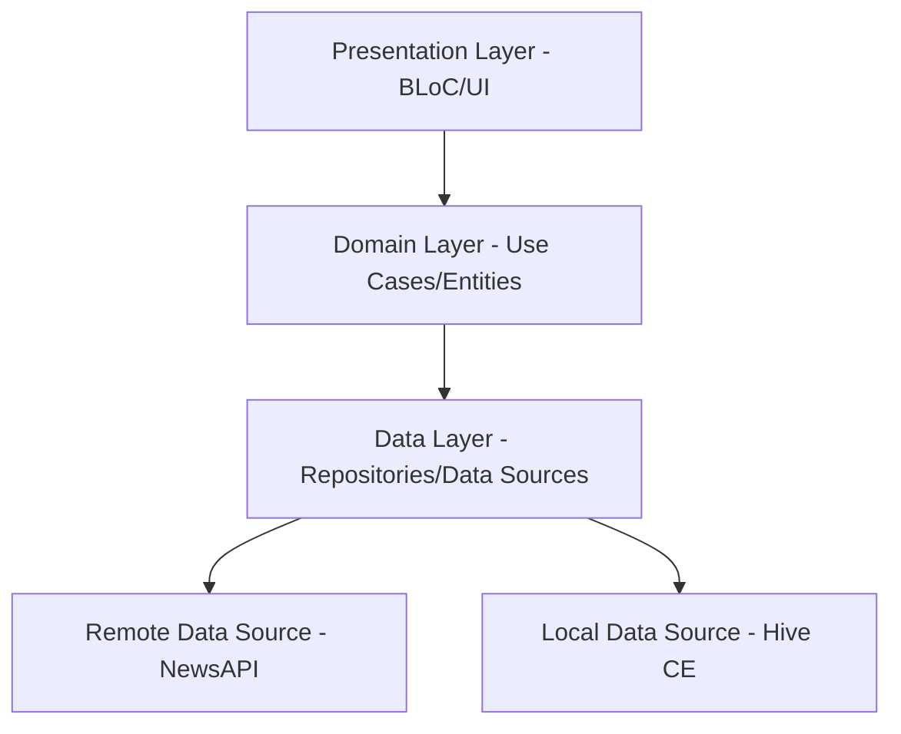
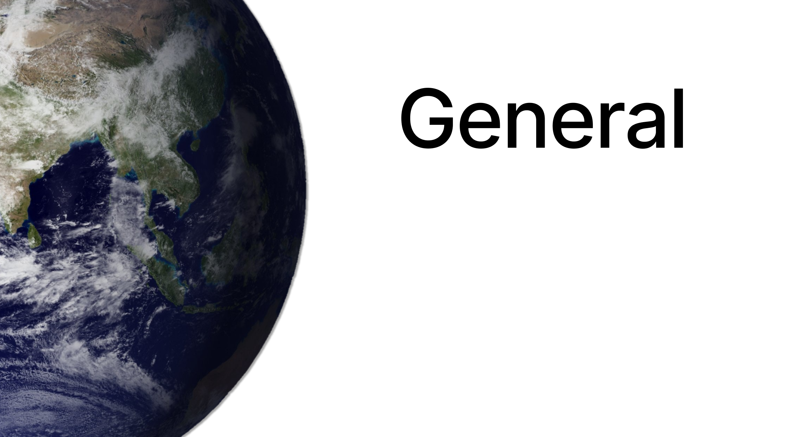
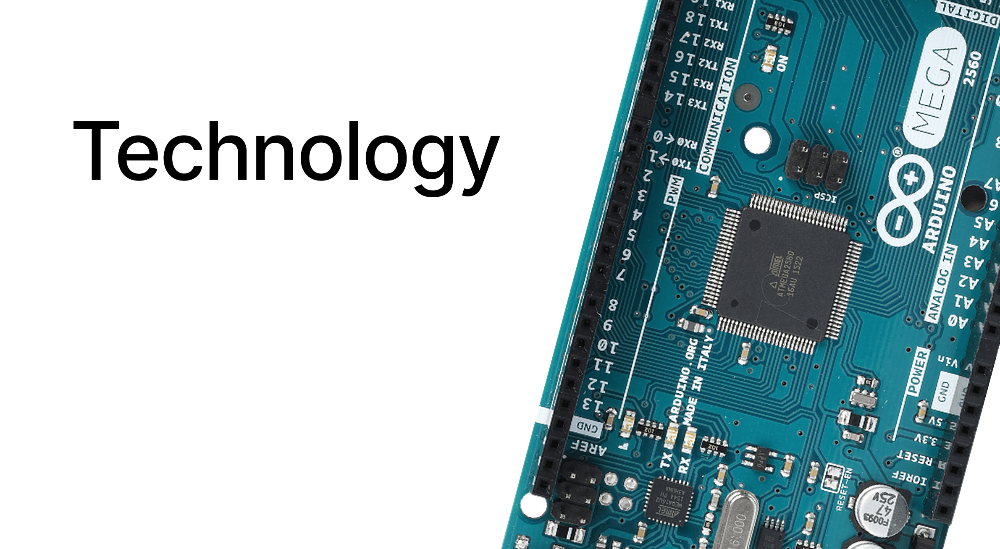

# News App | Flutter Clean Architecture


[](https://flutter.dev)
[](https://dart.dev)
[](https://blog.cleancoder.com/uncle-bob/2012/08/13/the-clean-architecture.html)

**News App** is a high-performance, professional mobile application designed to keep you updated with the latest headlines from around the world. Built with **Flutter** and adhering to strict **Clean Architecture** principles, it provides a seamless experience even in offline environments.

## 🚀 Key Features

- **Offline-First Synchronization**: Powered by **Hive CE (Community Edition)**. The app caches every article and source locally, allowing for instant access without an internet connection.
- **Domain-Driven Design**: Complete separation of Concerns between UI, Business Logic, and Data sourcing.
- **MVVM + BLoC State Management**: Predictable, event-driven transitions and reactive UI updates.
- **Dependency Injection**: Highly modular and testable code using **Injectable** and **GetIt**.
- **Paginated Scrolling**: Optimized data fetching for large news feeds to minimize bandwidth usage.
- **Global Search**: Filter articles by keywords across multiple sources.
- **Adaptive Theming**: Full support for both **Dark** and **Light** modes with a vibrant, modern UI.
- **Localization**: Ready for global audiences with built-in internationalization support.

## 🛠️ Technology Stack

| Layer | Tools & Libraries |
| :--- | :--- |
| **UI / Framework** | Flutter (Dart) |
| **State Management** | Flutter BLoC (MVVM) |
| **Local Database** | Hive CE (Community Edition) |
| **Dependency Injection** | Injectable, GetIt |
| **Networking** | http |
| **Connectivity** | Connectivity Plus |
| **Assets/Images** | Cached Network Image |

## 🏗️ Architecture Overview

The project follows a modular **Clean Architecture** structure:



- **Domain Layer**: Contains the core business logic (Use Cases) and data definitions (Entities). It is independent of any third-party framework.
- **Data Layer**: Responsible for retrieving data from the network or local database and mapping it to domain-friendly formats.
- **Presentation Layer**: Manages the UI and user interactions using the BLoC pattern to separate the visual components from the logic.

## 📸 Screenshots

| Categories | News List | Article Details |
| :---: | :---: | :---: |
|  |  |  |
*(Demo images from assets folder)*

## ⚙️ Installation & Setup

1. **Clone the repository**:
   ```bash
   git clone https://github.com/Mustafa-Mohamed26/news_app.git
   ```

2. **Install dependencies**:
   ```bash
   flutter pub get
   ```

3. **Generate code (Injectable & Hive Adapters)**:
   ```bash
   dart run build_runner build -d
   ```

4. **Run the app**:
   ```bash
   flutter run
   ```

---
*Developed by Mustafa Mohamed*
